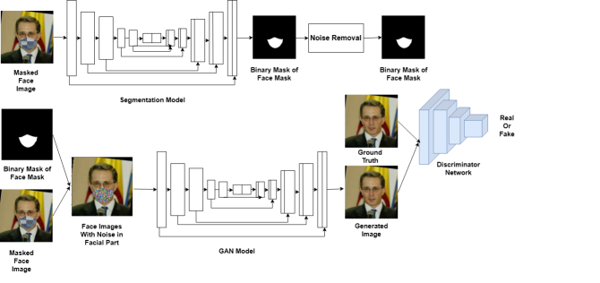
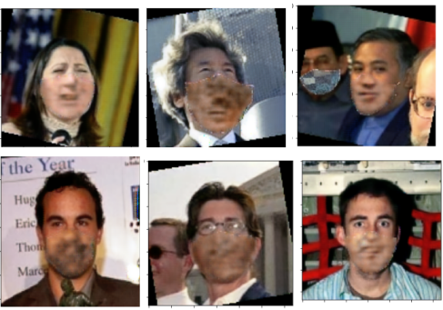

README
======


# FUGAN model
 A GAN based face regeneration module to recover covered area of faces hidden by masks. Model achieves SOTA performance in SSIM, PSNR and BRISQUE metrices. Comparison with other model in terms of different metrices in given below. Model generates realistic face images which can fool the face recogniation model as real image, and detect the faces. But all the tests are performed in synthetic datatset. real face images and natural environment testing are yet to scope of future work. In terms of Deployment, FUGAN model with pair of  SegUnet model can be deployable in Jetson nano to Xavier module with 4GB to 8GB ram capacity. Model pair only takes 140 MB ram spaces with minimal GPU load to regenerate the faces. One demonstartion video in jetson xavier nx is given below along with deployment .py file. Different test case senario is also given and .ipynb script is also provided.

## Dataset Generation 
 Huge dataset required for training and testing of face regeneration models. for this syntethic dataset is used. Here train folder is created under this binary_mask and inputs and outputs foder is created. One example of dataset creation is given.
## Model architecture with training loop


## Training and testing 
For first phase training (all training are done in linux environment and can be run in windows environment)
```
python3 mask_gan_modified_final_pipeline.py
```

For second phse training with modified loss function.
```
python3 mask_gan_modified_final_pipeline_modified.py
```
For testing and training both can be used from one ipynb script
``` Mask_GAN_modified.ipynb```
script can be used with [Google colab](https://colab.research.google.com/) or Anaconda or VS Code juoyter extension.
## Test Images
**Example of regeneration task of facial part**


**Generation of images at different epochs**


**Failure of model at regenration of face images**



**Comparison of generated face images. In the figure from left to right, images are masked face image, Ground Truth, Generated Face Image(ours), NIZAM UD DIN et al., Divyam Gupta et al., Hitoshi Yoshihashi et al.**


**GIF of face regeneration at different epochs**


## Comparison of Models

|Proposed Model| SSIM| PSNR(dB)| FID| BRISQUE|
|--------------|:----:|:------:|:-----:|:------:|
|NIZAM UD DIN| 0.864| 26.19| **3.548**| 37.85|
|Akhil Kumar | 0.91231| 30.9879| 6.8 |35.644|
|Farnaz Farahanipad | 0.89| 28.65| 13.63| 36.52|
|Hitoshi Yoshihashi | 0.926| 28.789| 9.4| 29.547|
|Divyam Gupta| 0.85752| 24.998| 5.64| 39.77|
|Ours| **0.928**| **31.748** |4.4| **27.990**|

In the below chart we provided no of trainable parameter along with non-trainable parameter is provided

|Proposed Model| Trainable Parameter| Non trainable parameter|
|--------------|:----:|:------:|
|NIZAM UD DIN| | |
|Akhil Kumar | ||
|Farnaz Farahanipad | | |
|Hitoshi Yoshihashi | | |
|Divyam Gupta| | |
|Ours| 17657891| 46587|


## IOT device deployment (Jetson Xavier nx)
The trained model deployed in the IOT devices with no added support. Script contained code for integrating webcam which further helps in real image testing (Future work). Model can be accessed using: 
``` 
python3 live_test.py
```
video for deployment:

<video width="630" height="300" src="https://github.com/mrinmoy-sadhukhan/FUGAN-model/assets/72397091/5754037a-4cb2-4278-9603-8043a5144002"></video>

comparison of inference time in IOT devices and Laptop.

|Inference time(in sec)|Jetson Device(8GB ram)|Laptop(16GB ram)|
|-----------|:---------------:|----------:|
|For first time run| 10.31|5.21|
|For secon time run model loaded in memory|2.31|2.1|
